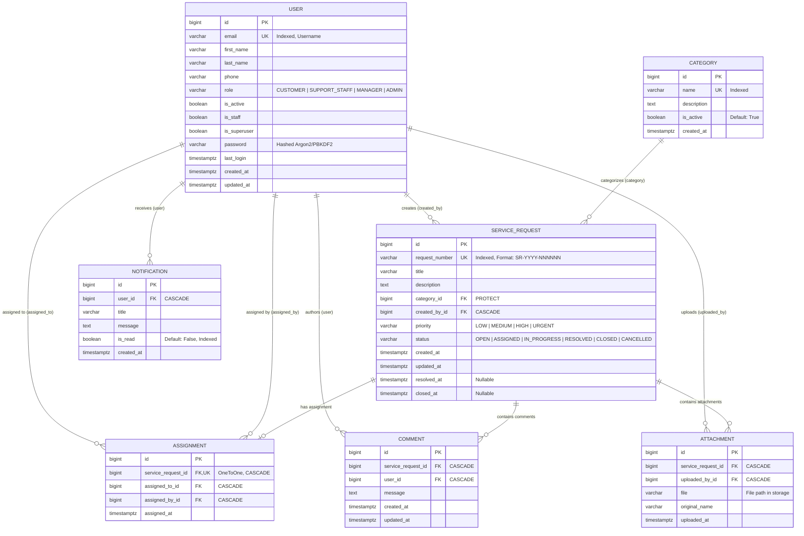
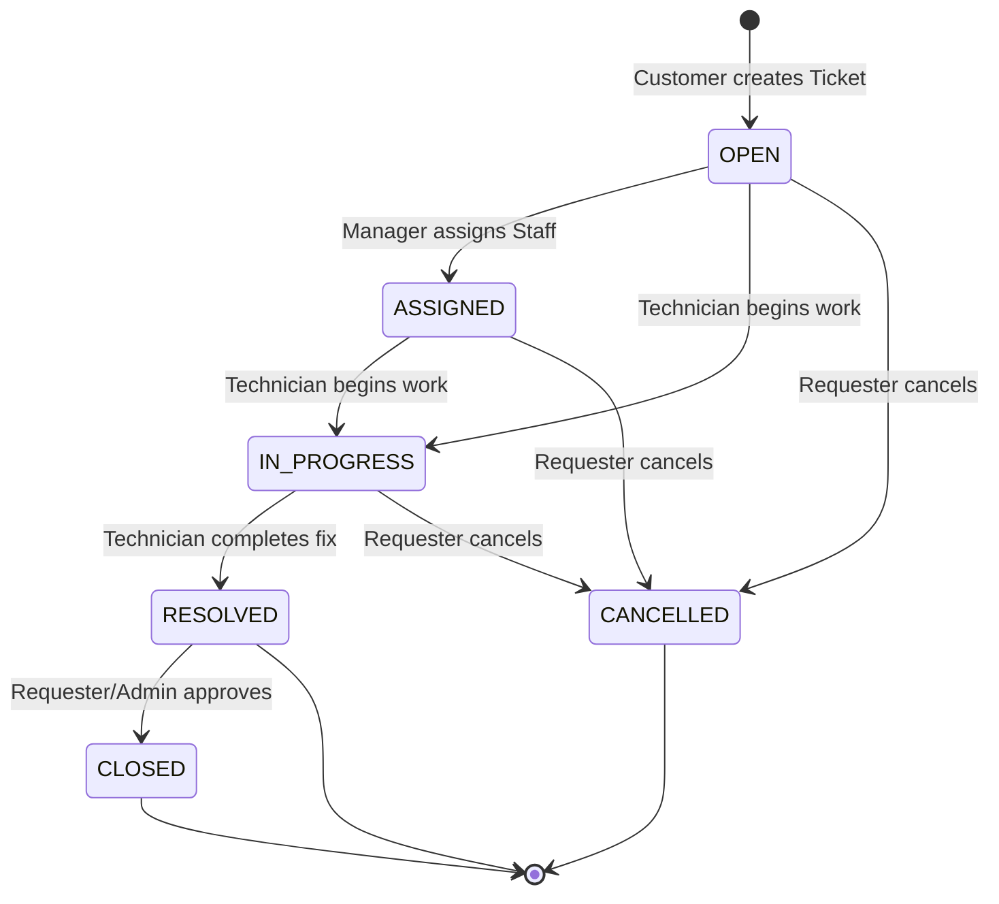

# Database Architecture & Schema Documentation

**System**: ServiceDesk Pro — Enterprise Service Management  
**RDBMS**: PostgreSQL 16+ (Neon Serverless) / SQLite (Local Fallback)  
**ORM**: Django 6.1 ORM  

---

## 1. High-Level Entity-Relationship Diagram (ERD)



---

## 2. Table Specifications & Data Dictionaries

### 2.1 `users_user` (Users Table)
Stores user accounts for Customers, Support Staff, Managers, and System Administrators.

| Column | Data Type | Constraints / Modifiers | Description |
| :--- | :--- | :--- | :--- |
| `id` | `BIGINT` | `PK`, `AUTO_INCREMENT` | Unique user identifier |
| `email` | `VARCHAR(254)` | `UNIQUE`, `NOT NULL`, `INDEX` | Login identifier & work email |
| `password` | `VARCHAR(128)` | `NOT NULL` | Salted password hash |
| `first_name` | `VARCHAR(100)` | `NOT NULL` | User first name |
| `last_name` | `VARCHAR(100)` | `NOT NULL` | User last name |
| `phone` | `VARCHAR(20)` | `NULLABLE`, `DEFAULT ''` | Contact telephone number |
| `role` | `VARCHAR(20)` | `NOT NULL`, `DEFAULT 'CUSTOMER'` | Role Enum (`CUSTOMER`, `SUPPORT_STAFF`, `MANAGER`, `ADMIN`) |
| `is_active` | `BOOLEAN` | `NOT NULL`, `DEFAULT TRUE` | Account status flag |
| `is_staff` | `BOOLEAN` | `NOT NULL`, `DEFAULT FALSE` | Django Admin access flag |
| `is_superuser` | `BOOLEAN` | `NOT NULL`, `DEFAULT FALSE` | Superuser permissions flag |
| `last_login` | `TIMESTAMPTZ`| `NULLABLE` | Timestamp of last authentication |
| `created_at` | `TIMESTAMPTZ`| `NOT NULL`, `DEFAULT NOW()` | Record creation timestamp |
| `updated_at` | `TIMESTAMPTZ`| `NOT NULL`, `AUTO UPDATE` | Last modification timestamp |

---

### 2.2 `categories` (Service Categories)
Classifies tickets into business and IT domains (e.g., Hardware, Software, Network, Access Provisioning).

| Column | Data Type | Constraints / Modifiers | Description |
| :--- | :--- | :--- | :--- |
| `id` | `BIGINT` | `PK`, `AUTO_INCREMENT` | Unique category identifier |
| `name` | `VARCHAR(100)` | `UNIQUE`, `NOT NULL` | Category name |
| `description` | `TEXT` | `NULLABLE`, `DEFAULT ''` | Scope description and SLAs |
| `is_active` | `BOOLEAN` | `NOT NULL`, `DEFAULT TRUE` | Availability flag for ticket creation |
| `created_at` | `TIMESTAMPTZ`| `NOT NULL`, `AUTO_NOW_ADD` | Registration timestamp |

---

### 2.3 `service_requests` (Service Requests / Tickets)
Core entity storing customer tickets, current lifecycle status, and timestamps.

| Column | Data Type | Constraints / Modifiers | Description |
| :--- | :--- | :--- | :--- |
| `id` | `BIGINT` | `PK`, `AUTO_INCREMENT` | Internal primary key |
| `request_number` | `VARCHAR(30)` | `UNIQUE`, `NOT NULL`, `INDEX` | Human-friendly ID (`SR-YYYY-NNNNNN`) |
| `title` | `VARCHAR(200)` | `NOT NULL` | Short summary of issue |
| `description` | `TEXT` | `NOT NULL` | Full technical details & instructions |
| `category_id` | `BIGINT` | `FK (categories.id)`, `ON DELETE PROTECT` | Associated category |
| `created_by_id` | `BIGINT` | `FK (users_user.id)`, `ON DELETE CASCADE` | Customer or requester |
| `priority` | `VARCHAR(10)` | `NOT NULL`, `DEFAULT 'MEDIUM'` | `LOW`, `MEDIUM`, `HIGH`, `URGENT` |
| `status` | `VARCHAR(20)` | `NOT NULL`, `DEFAULT 'OPEN'` | Lifecycle state (see Section 3) |
| `created_at` | `TIMESTAMPTZ`| `NOT NULL`, `AUTO_NOW_ADD`, `INDEX` | Submission time |
| `updated_at` | `TIMESTAMPTZ`| `NOT NULL`, `AUTO_NOW` | Last modified time |
| `resolved_at` | `TIMESTAMPTZ`| `NULLABLE` | Timestamp when marked `RESOLVED` |
| `closed_at` | `TIMESTAMPTZ`| `NULLABLE` | Timestamp when marked `CLOSED` |

---

### 2.4 `assignments` (Staff Ticket Allocations)
Maintains the 1-to-1 relationship between an active ticket and the assigned technician.

| Column | Data Type | Constraints / Modifiers | Description |
| :--- | :--- | :--- | :--- |
| `id` | `BIGINT` | `PK`, `AUTO_INCREMENT` | Assignment ID |
| `service_request_id` | `BIGINT` | `FK (service_requests.id)`, `UNIQUE`, `CASCADE` | Target Service Request |
| `assigned_to_id` | `BIGINT` | `FK (users_user.id)`, `CASCADE` | Assigned technician / staff member |
| `assigned_by_id` | `BIGINT` | `FK (users_user.id)`, `CASCADE` | Manager or dispatcher assigning ticket |
| `assigned_at` | `TIMESTAMPTZ`| `NOT NULL`, `AUTO_NOW_ADD` | Timestamp of allocation |

---

### 2.5 `comments` (Ticket Discussions & Notes)
Chronological stream of messages between requester, technician, and management.

| Column | Data Type | Constraints / Modifiers | Description |
| :--- | :--- | :--- | :--- |
| `id` | `BIGINT` | `PK`, `AUTO_INCREMENT` | Comment ID |
| `service_request_id` | `BIGINT` | `FK (service_requests.id)`, `CASCADE`, `INDEX` | Associated ticket |
| `user_id` | `BIGINT` | `FK (users_user.id)`, `CASCADE` | Author of message |
| `message` | `TEXT` | `NOT NULL` | Communication / note content |
| `created_at` | `TIMESTAMPTZ`| `NOT NULL`, `AUTO_NOW_ADD`, `INDEX` | Posted timestamp |
| `updated_at` | `TIMESTAMPTZ`| `NOT NULL`, `AUTO_NOW` | Last edit timestamp |

---

### 2.6 `attachments` (File Uploads)
Diagnostic screenshots, logs, specifications, and invoices attached to tickets.

| Column | Data Type | Constraints / Modifiers | Description |
| :--- | :--- | :--- | :--- |
| `id` | `BIGINT` | `PK`, `AUTO_INCREMENT` | Attachment ID |
| `service_request_id` | `BIGINT` | `FK (service_requests.id)`, `CASCADE`, `INDEX` | Associated ticket |
| `uploaded_by_id` | `BIGINT` | `FK (users_user.id)`, `CASCADE` | User who uploaded the file |
| `file` | `VARCHAR(100)` | `NOT NULL` | Stored media path |
| `original_name` | `VARCHAR(255)` | `NOT NULL` | Original client-side file name |
| `uploaded_at` | `TIMESTAMPTZ`| `NOT NULL`, `AUTO_NOW_ADD` | Upload timestamp |

---

### 2.7 `notifications` (User Alerts)
System alerts dispatched when status updates, comments, or assignments occur.

| Column | Data Type | Constraints / Modifiers | Description |
| :--- | :--- | :--- | :--- |
| `id` | `BIGINT` | `PK`, `AUTO_INCREMENT` | Notification ID |
| `user_id` | `BIGINT` | `FK (users_user.id)`, `CASCADE`, `INDEX` | Recipient user |
| `title` | `VARCHAR(200)` | `NOT NULL` | Brief alert subject |
| `message` | `TEXT` | `NOT NULL` | Alert details |
| `is_read` | `BOOLEAN` | `NOT NULL`, `DEFAULT FALSE`, `INDEX` | Read / Unread status |
| `created_at` | `TIMESTAMPTZ`| `NOT NULL`, `AUTO_NOW_ADD` | Dispatch timestamp |

---

## 3. Enumerations & State Machines

### 3.1 User Roles (`UserRole`)
```
CUSTOMER ──► Can create tickets, post comments, view own requests.
SUPPORT_STAFF ──► Can receive assignments, update status, view all requests.
MANAGER ──► Can assign staff, alter categories, supervise all workflows.
ADMIN ──► Full system control & Django Admin access.
```

### 3.2 Service Request Priority (`RequestPriority`)
- `LOW`: Standard maintenance / non-critical.
- `MEDIUM`: Normal business operations (Default).
- `HIGH`: Degraded performance affecting business workflow.
- `URGENT`: Outage or severe blocker requiring immediate dispatch.

### 3.3 Ticket Lifecycle State Machine (`RequestStatus`)


---

## 4. Query & Database Optimization Strategy

1. **Foreign Key Indexes**:
   - `service_requests.category_id`, `service_requests.created_by_id`, `comments.service_request_id`, `attachments.service_request_id`, and `notifications.user_id` have B-Tree indexes created automatically by Django ORM.

2. **N+1 Prevention**:
   - Views leverage `select_related("category", "created_by")` and `prefetch_related` on `comments` and `attachments`.
   - `only(...)` projections are used in listing pages to avoid loading large `TEXT` columns like `description` or `message` when rendering tables.

3. **Caching Layer**:
   - In-memory caching (`LocMemCache`) caches static lookups:
     - `active_categories_list` (TTL: 60s)
     - `staff_users_list` (TTL: 60s)
     - `unread_notifications_count_{user_id}` (TTL: 30s)

4. **Connection Management**:
   - `CONN_MAX_AGE = 0` configured for serverless PostgreSQL to avoid stale socket exceptions.
