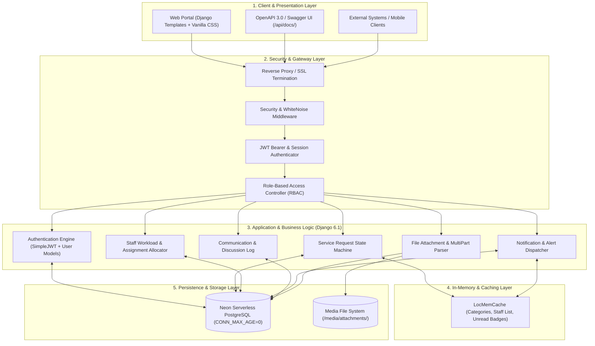

# System Architecture & Design Prompts

**System**: ServiceDesk Pro — Enterprise Service Management System  
**Framework**: Django 6.1 / Django REST Framework (DRF)  
**Database**: PostgreSQL 16+ (Neon Serverless) / SQLite  
**Documentation Version**: 1.0.0  

---

## 1. System Architecture Overview

ServiceDesk Pro follows a **layered, decoupled enterprise architecture** designed for high availability, scalable ticket management, and strict role-based access control (RBAC).



---

## 2. Layer Specifications

### 2.1 Layer 1: Client & Presentation
- **Web UI**: Server-side rendered Django templates using vanilla responsive CSS with dark-mode aesthetic, Glassmorphism elements, and Chart.js analytical dashboards.
- **REST API / Swagger Docs**: Interactive API documentation generated dynamically via `drf-spectacular` at `/api/docs/` and `/api/schema/`.
- **API Consumers**: External clients communicating via JSON with JWT Bearer token authentication.

### 2.2 Layer 2: Security & Gateway
- **Reverse Proxy / SSL**: Handles HTTPS redirection and header forwarding (`HTTP_X_FORWARDED_PROTO`).
- **Middleware Chain**:
  - `SecurityMiddleware` & `WhiteNoiseMiddleware` for compressed static asset delivery.
  - `CsrfViewMiddleware` enforcing CSRF protection on UI forms.
  - `AuthenticationMiddleware` & `JWTAuthentication` for dual web session / stateless token support.
- **Role-Based Access Control (RBAC)**: Enforces permissions based on 4 roles: `CUSTOMER`, `SUPPORT_STAFF`, `MANAGER`, and `ADMIN`.

### 2.3 Layer 3: Application Core & Modules
- **Authentication**: JWT token pair generation (access + rotating refresh), password hashing via PBKDF2.
- **Service Request Engine**: Manages ticket lifecycle states (`OPEN` $\to$ `ASSIGNED` $\to$ `IN_PROGRESS` $\to$ `RESOLVED` $\to$ `CLOSED`), auto-generating ticket identifiers (`SR-YYYY-NNNNNN`).
- **Staff Assignment**: 1-to-1 allocation of open requests to designated technicians with dispatcher tracking.
- **Audit & Discussion**: Chronological discussion threads and document repository.
- **Notification Engine**: Triggers real-time alerts when assignments or status changes occur.

### 2.4 Layer 4: Caching Layer
- In-memory `LocMemCache` prevents redundant database round-trips for frequently read, infrequently updated entities:
  - `active_categories_list` (TTL: 60s)
  - `staff_users_list` (TTL: 60s)
  - `unread_notifications_count_<user_id>` (TTL: 30s)

### 2.5 Layer 5: Data & Persistence Layer
- **Relational DB**: Neon Serverless PostgreSQL with SSL connection mode (`CONN_MAX_AGE=0` for serverless lifecycle safety).
- **Media Storage**: Dedicated filesystem storage for file attachments with original filename metadata preservation.

---

## 3. Image Generation Prompts (Midjourney / DALL-E 3 / Flux)

You can copy and paste the following prompts into any modern AI image generator:

### Prompt 1: Futuristic Enterprise Cloud System Architecture (Best for Presentations)
```text
A futuristic, high-tech enterprise software system architecture infographic diagram for 'ServiceDesk Pro'. Dark mode theme with sleek slate-navy background, neon electric-blue, violet, and turquoise glowing data paths. Multi-tiered architecture displaying 5 organized layers: Client Layer (Web Portal, REST API, Swagger), Security & Gateway Layer (JWT Authentication, RBAC, SSL), Application Layer (Django 6.1 Core, Ticket Engine, Assignment Manager), In-Memory Caching Grid, and Data Storage Layer (Neon PostgreSQL Serverless Database, Media File Storage). Isometric card design, glowing server nodes, micro-charts, sleek data pipelines, Figma UI design aesthetic, 8k resolution, crisp typography, clean vector lines.
```

### Prompt 2: 3D Isometric Server & Cloud Infrastructure
```text
3D isometric cloud architecture diagram for an enterprise IT service desk platform. Floating transparent glassmorphic layers in a dark environment. Glowing cyan and purple fiber-optic cables connecting frontend clients to Django application cluster, in-memory cache cylinder, and PostgreSQL database server. Soft studio lighting, Octane render style, Unreal Engine 5 aesthetic, clean tech startup whitepaper infographic, high fidelity.
```

### Prompt 3: Minimalist Technical Blueprint / Whitepaper Style
```text
Clean, modern 2D technical system architecture diagram, minimalist corporate style with crisp white and dark slate gray color palette, cyan accents. Modular engineering blocks showing Client Layer, API Gateway, Django REST Framework application services, Cache layer, and PostgreSQL database. Clean directional arrows, database schemas, professional software engineering documentation standard.
```

---

## 4. Diagram-as-Code Prompts

### 4.1 Mermaid.js Component Architecture

```mermaid
graph LR
    subgraph Users ["Users"]
        C["Customer"]
        S["Support Staff"]
        M["Manager / Admin"]
    end

    subgraph Gateway ["Gateway & Auth"]
        API["REST API (/api/)"]
        WebUI["Web Portal (/ui/)"]
        JWT["JWT Auth & Sessions"]
    end

    subgraph Core ["Django Application Core"]
        SR["Service Requests Engine"]
        AS["Assignment System"]
        CM["Comments & Attachments"]
        NT["Notification System"]
    end

    subgraph Data ["Data & Storage"]
        Cache[("LocMem Cache")]
        Postgres[("PostgreSQL 16")]
        Files[("Media Files")]
    end

    C --> WebUI
    C --> API
    S --> WebUI
    S --> API
    M --> WebUI
    M --> API

    WebUI --> JWT
    API --> JWT

    JWT --> SR
    JWT --> AS
    JWT --> CM
    JWT --> NT

    SR <--> Cache
    NT <--> Cache

    SR --> Postgres
    AS --> Postgres
    CM --> Postgres
    NT --> Postgres
    CM --> Files
```


### 4.2 C4 Model: Container Diagram (PlantUML)
```plantuml
@startuml
!include https://raw.githubusercontent.com/plantuml-stdlib/C4-PlantUML/master/C4_Container.puml

Person(customer, "Customer", "Submits requests and tracks resolution")
Person(staff, "Support Staff", "Resolves tickets and posts updates")
Person(admin, "Manager / Admin", "Manages assignments and categories")

System_Boundary(c1, "ServiceDesk Pro System") {
    Container(web_app, "Web Application", "Django Templates, HTML5, CSS", "Delivers management interface")
    Container(api, "REST API", "Django REST Framework", "Provides JSON endpoints with JWT auth")
    Container(cache, "Cache Store", "LocMemCache", "Caches categories and notification counts")
    ContainerDb(db, "Database", "Neon PostgreSQL", "Stores users, tickets, comments, assignments")
    Container(storage, "Media Storage", "File System", "Stores document & image attachments")
}

Rel(customer, web_app, "Uses", "HTTPS")
Rel(staff, web_app, "Uses", "HTTPS")
Rel(admin, web_app, "Uses", "HTTPS")

Rel(customer, api, "Calls", "JSON/HTTPS")
Rel(staff, api, "Calls", "JSON/HTTPS")

Rel(web_app, db, "Reads/Writes", "psycopg2/SQL")
Rel(api, db, "Reads/Writes", "psycopg2/SQL")
Rel(web_app, cache, "Reads/Writes", "In-Memory")
Rel(web_app, storage, "Uploads/Downloads", "File I/O")
@enduml
```
